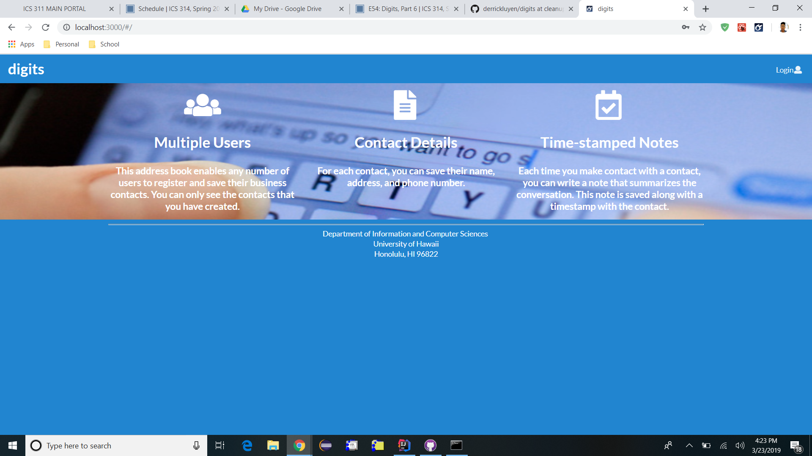
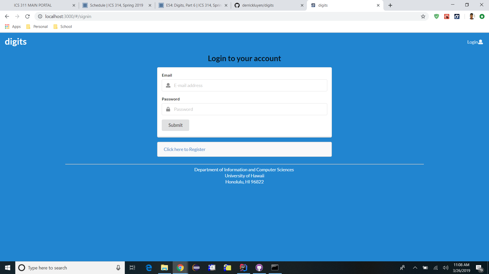
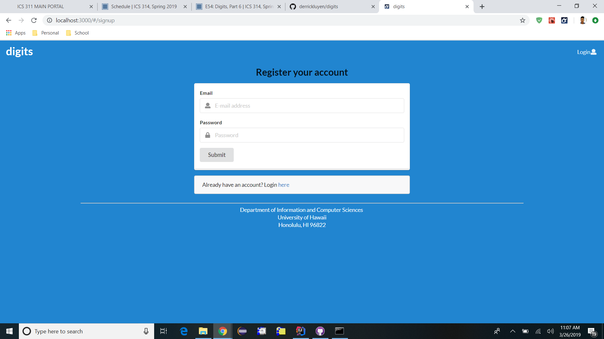
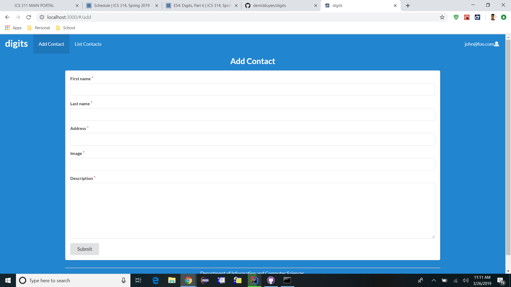
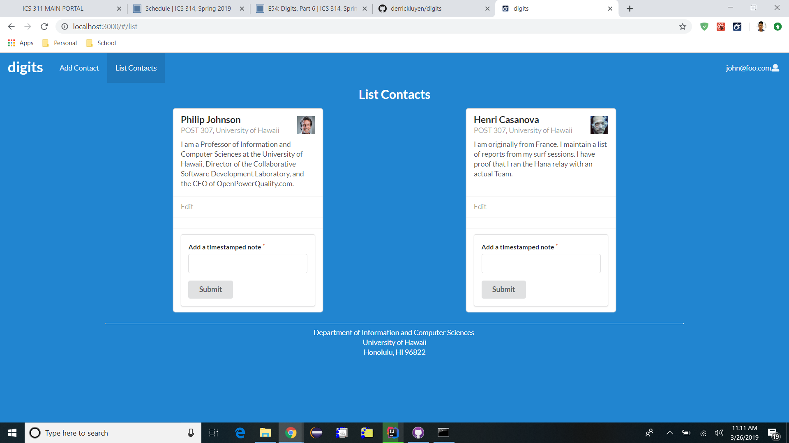
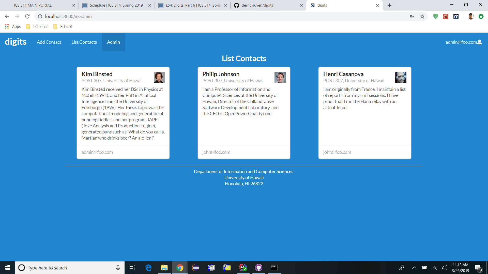
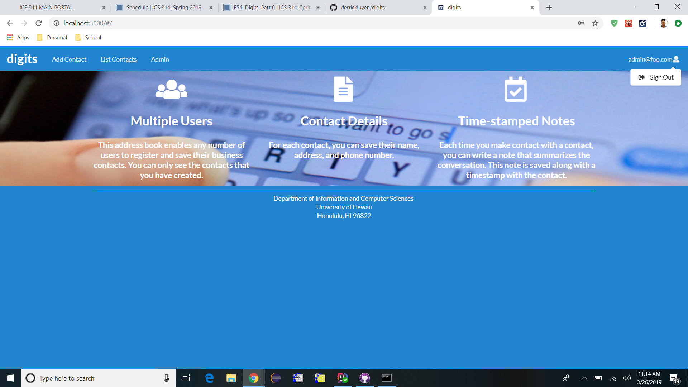
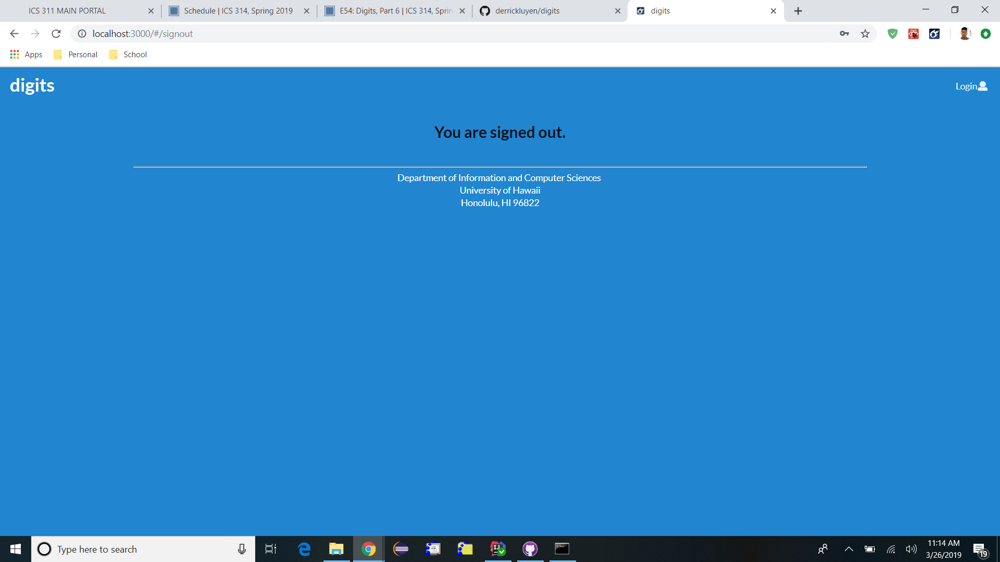

<h3>Walkthrough of the digits site</h3>

<h3>Installation Instructions</h3>
Fork this digits Github repository and clone into workspace. cd into the app directory and run the following command: $ meteor npm install. Now you can start up the program by running: $ meteor npm run start. You can now view the site at http://localhost:3000/

<h3>Landing Page</h3>

The landing page is the first page you see when you first open the page. It is basically the home page. 

From there, you have two options. Hover over the login button which gives you the option to sign in or sign up. 

Clicking on sign in leads you to this page. From here, you can enter your email address and password in order to register your account.

Clicking on sign up leads you to this page. From here, you can enter your email address and password in order to log in to your account.

Once you sign in, you have a couple of options.

The first option is the AddContact option. Clicking on that menu option leads you to this screen, as shown above. From there, you can add new contacts to the database as you wish. 

The second option is the ListContact option. Clicking on that menu option leads you to this screen, as shown above. From there, you can see the list of contacts that have been added by your account. There are two features on this page. The first is the Edit feature. By clicking on this, you can edit the information about a specific contact. The second feature is the time stamped note. With this feature, you can add a note related to that contact and it willbe time stamped to show when it was added.

This page, as shown above, is a special page that only admin have access to. On this page, you are able to see all the contacts that have been added to the database as well as which accounts they are associated with.

If you widh to sign out of your account, hover over your email in the top right corner and the signout option should appear. 

Clicking on that option should lead you to this page which shows that you have officially signed out.
